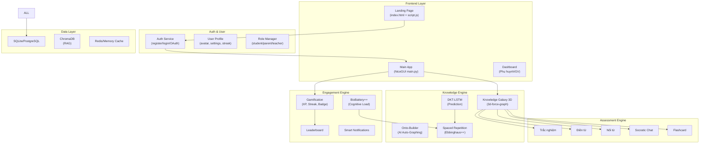

# 🏗️ MASTER BLUEPRINT: Biến PKT Bio-Tutor Thành "Siêu Quizlet 3D"

> **Tầm nhìn:** Sản phẩm cây tri thức cá nhân hóa đạt chuẩn dự thi khởi nghiệp, tương đương Quizlet nhưng vượt trội nhờ công nghệ sâu (Deep Tech): Đồ thị 3D + AI Socratic + BioBattery.

---

## 📊 PHÂN TÍCH HIỆN TRẠNG (AS-IS) vs MỤC TIÊU (TO-BE)

### Những gì ĐÃ CÓ trong codebase hiện tại:

| Thành phần | Trạng thái | File liên quan |
|---|---|---|
| ✅ Đồ thị 3D (3d-force-graph) | Hoạt động, WebGL | `step2_5_visualize_tree.py` |
| ✅ Elo Rating System | Hoạt động, lưu SQLite | `pkt_engine.py` |
| ✅ BioBattery UI | Cơ bản, HTML/CSS | `bio_battery.py` |
| ✅ Quiz (MCQ, Fill-blank, Match, Socratic) | Hoạt động, AI-generated | `quiz_page.py` |
| ✅ RAG Chat (Advanced) | Hoạt động, ChromaDB | `services/rag_service.py` |
| ✅ DKT-LSTM Prediction | Khung sườn, chưa train | `models/dkt_model.py`, `services/prediction_service.py` |
| ✅ Ebbinghaus Forgetting Curve | Cơ bản | `knowledge_tracing.py` |
| ✅ AI Video Player | Tương tác cơ bản | `ai_video_player.py` |
| ✅ Database (SQLite) | User, InteractionLog, KnowledgeState | `database.py` |
| ✅ Graph Studio (Upload & Build Tree) | Hoạt động | `main.py` (tab_studio) |

### Những gì CẦN XÂY DỰNG để đạt chuẩn "Siêu Quizlet":

| Thành phần | Mức ưu tiên | Độ phức tạp |
|---|---|---|
| 🔴 Hệ thống Auth (Đăng ký/Đăng nhập/Quên MK) | P0 - Critical | Medium |
| 🔴 Landing Page chuyên nghiệp | P0 - Critical | High |
| 🔴 Gamification Engine (XP, Streak, Achievement) | P0 - Critical | High |
| 🟡 Dashboard Phụ huynh/Giáo viên | P1 - Important | Medium |
| 🟡 Spaced Repetition nâng cao (Smart Schedule) | P1 - Important | Medium |
| 🟡 Flashcard Mode | P1 - Important | Low |
| 🟡 Leaderboard & Social Sharing | P1 - Important | Medium |
| 🟢 UGC Marketplace (Chợ cây tri thức) | P2 - Nice to have | High |
| 🟢 Freemium Paywall | P2 - Nice to have | Medium |
| 🟢 Mobile Responsive / PWA | P2 - Nice to have | Medium |

---

## 🗺️ KIẾN TRÚC TỔNG THỂ SAU NÂNG CẤP



---

## 📋 GIAI ĐOẠN 1: HỆ THỐNG TÀI KHOẢN & ONBOARDING
**Thời gian ước tính:** 3-4 ngày | **Ưu tiên:** 🔴 P0

> [!IMPORTANT]
> Đây là nền tảng bắt buộc. Không có hệ thống auth hoàn chỉnh, sản phẩm không thể demo trước ban giám khảo với nhiều người dùng.

### 1.1 Đăng ký & Đăng nhập

**Hiện trạng:** Mock login cứng (`sv01`) trong `main.py:71-74`.

**Mục tiêu:**
- [ ] Trang đăng ký với form: Username, Email, Mật khẩu, Họ tên, Vai trò (Học sinh/Phụ huynh/Giáo viên)
- [ ] Trang đăng nhập với xác thực bcrypt
- [ ] Session management qua `app.storage.user`
- [ ] Trang quên mật khẩu (gửi OTP qua email - có thể mock cho demo)
- [ ] Redirect logic: chưa đăng nhập → landing page, đã đăng nhập → dashboard

#### [MODIFY] [database.py](file:///i:/MY_CODE/WebPersionalLearning/database.py)
- Thêm field `email`, `avatar_url`, `bio` vào model `User`
- Thêm model `UserSession` (token, expiry)
- Thêm hàm `authenticate_user(username, password)` dùng bcrypt

#### [NEW] `auth_service.py`
- Class `AuthService`: register, login, logout, validate_session
- Password hashing với bcrypt
- Session token generation

#### [MODIFY] [main.py](file:///i:/MY_CODE/WebPersionalLearning/main.py)
- Thêm `@ui.page('/login')` và `@ui.page('/register')`
- Thêm middleware kiểm tra auth trước khi vào trang chính
- Xóa mock login `sv01`

### 1.2 Onboarding Flow (Trải nghiệm người dùng mới)

**Mục tiêu:** Khi người dùng mới đăng ký xong, họ được dẫn qua wizard 3 bước:

- [ ] **Bước 1 - "Bạn muốn học gì?"**: Chọn môn học hoặc tải lên file tài liệu (PDF/TXT)
- [ ] **Bước 2 - "Cây Tri Thức Sống"**: AI tự động dệt Cây 3D từ tài liệu (animation loading ấn tượng)
- [ ] **Bước 3 - "Rà quét lỗ hổng miễn phí"**: Chạy 5 câu quiz nhanh để xác định baseline mastery

#### [NEW] `onboarding.py`
- Wizard UI 3 bước với stepper
- Tích hợp `step1_build_tree.py` và `step2_build_edges.py`
- Mini-quiz diagnostic từ câu hỏi AI-generated

### 1.3 User Profile & Settings

- [ ] Trang profile hiển thị: Avatar, thống kê tổng quan, streak, badges
- [ ] Cài đặt: đổi mật khẩu, dark/light mode, ngôn ngữ
- [ ] Liên kết tài khoản phụ huynh (parent code)

#### [NEW] `profile_page.py`
- Profile card với avatar (upload hoặc Gravatar)
- Statistics dashboard mini
- Settings panel

---

## 📋 GIAI ĐOẠN 2: NÂNG CẤP KNOWLEDGE GALAXY 3D
**Thời gian ước tính:** 4-5 ngày | **Ưu tiên:** 🔴 P0

> [!TIP]
> Đây là "vũ khí thị giác" số 1 trước ban giám khảo. Khi họ quét QR code, thứ đầu tiên phải gây "Wow" là không gian 3D này.

### 2.1 Visual Overhaul (Cải tiến thị giác)

**Hiện trạng:** 3D graph cơ bản với 3 loại node (macro/micro/assess), màu tĩnh.

**Mục tiêu:**
- [ ] **Particle System**: Các hạt particle bay giữa các node đã kết nối, mô phỏng "dòng chảy kiến thức"
- [ ] **Bloom Effect**: Nodes thành thạo phát sáng (glow) mạnh, nodes yếu mờ nhạt
- [ ] **Nebula Background**: Background không gian với gradient nebula thay vì solid color
- [ ] **Node Labels 3D**: Text hiển thị rõ hơn với billboard sprites
- [ ] **Connection Animations**: Các đường nối giữa nodes có hiệu ứng "chạy mạch điện" (electric pulse)

#### [MODIFY] [step2_5_visualize_tree.py](file:///i:/MY_CODE/WebPersionalLearning/step2_5_visualize_tree.py)
- Nâng cấp hàm `visualize_knowledge_tree()`:
  - Thêm custom shaders cho node glow effect
  - Particle system dọc theo edges
  - Animated node halos dựa trên mastery level
  - Pulsating effect (nhấp nháy Vàng/Cam) cho nodes sắp quên (Ebbinghaus)
  - Sound effects nhẹ khi click node (optional)

### 2.2 Interaction Enhancements (Tương tác nâng cao)

- [ ] **Zoom-to-Focus**: Double-click node → camera bay mượt tới node, panel mở ra
- [ ] **Path Highlighting**: Khi chọn 1 node, highlight toàn bộ đường đi prerequisite
- [ ] **Minimap**: Bản đồ thu nhỏ ở góc dưới phải hiển thị vị trí camera
- [ ] **Filter Controls**: Lọc theo trạng thái (Xanh/Đỏ/Vàng), theo chương
- [ ] **Progress Ring**: Vòng tròn tiến độ tổng quát ở góc, hiển thị % hoàn thành cây

#### [MODIFY] [step2_5_visualize_tree.py](file:///i:/MY_CODE/WebPersionalLearning/step2_5_visualize_tree.py)
- Thêm JS cho minimap (canvas 2D overlay)
- Filter toolbar HTML overlay
- Progress ring SVG component

### 2.3 Real-time Sync (Đồng bộ thời gian thực)

**Hiện trạng:** Polling mỗi 3 giây qua fetch.

**Mục tiêu:**
- [ ] Khi học sinh làm quiz xong trên cửa sổ pop-up → node trên cây 3D thay đổi màu NGAY LẬP TỨC (không chờ 3s)
- [ ] Animation chuyển màu: Đỏ → Vàng → Xanh với hiệu ứng "sóng lan" (ripple)

#### [NEW] `services/realtime_sync.py`
- WebSocket hoặc Server-Sent Events để push update
- Hoặc tối ưu polling interval xuống 1s + debounce

---

## 📋 GIAI ĐOẠN 3: GAMIFICATION ENGINE
**Thời gian ước tính:** 5-6 ngày | **Ưu tiên:** 🔴 P0

> [!IMPORTANT]
> Đây là yếu tố "gây nghiện" mà Quizlet dùng để giữ chân 60 triệu người dùng. Không có Gamification, sản phẩm chỉ là tool học thuật khô khan.

### 3.1 XP (Experience Points) System

- [ ] Mỗi hành động tích cực → cộng XP:
  - Trắc nghiệm đúng: +10 XP
  - Điền từ đúng: +15 XP
  - Nối từ đúng: +15 XP
  - Socratic passed: +25 XP
  - Xem video xong: +5 XP
  - Login hàng ngày: +20 XP (Daily Bonus)
- [ ] XP Multiplier: Streak liên tục → nhân hệ số (x1.5, x2.0)
- [ ] Level System: XP tích lũy → Level (Tân binh → Học trò → Chiến binh → Bậc thầy → Huyền thoại)
- [ ] Level-up animation: Hiệu ứng pháo hoa, confetti khi lên level

#### [NEW] `gamification/xp_engine.py`
- Class `XPEngine`: add_xp(), get_level(), get_next_level_xp()
- XP multiplier logic dựa trên streak
- Level thresholds configuration

#### [MODIFY] [database.py](file:///i:/MY_CODE/WebPersionalLearning/database.py)
- Thêm model `UserProgress`:
  - `total_xp`, `current_level`, `current_streak`, `longest_streak`
  - `last_active_date`, `daily_xp_earned`

### 3.2 Streak System (Chuỗi ngày học liên tục)

- [ ] Đếm số ngày liên tiếp người dùng hoạt động (≥1 quiz hoặc ≥5 phút học)
- [ ] UI: Biểu tượng 🔥 cạnh avatar, hiển thị số ngày streak
- [ ] Calendar heatmap (giống GitHub contribution graph) trên profile
- [ ] Streak Freeze: Cho phép "đóng băng" streak 1 ngày (tính năng Premium)
- [ ] Thông báo push/email: "Bạn đang có streak 7 ngày! Đừng để mất!" 

#### [NEW] `gamification/streak_service.py`
- Check-in logic, streak calculation
- Streak freeze mechanism
- Notification trigger

### 3.3 Achievement & Badge System

- [ ] Hệ thống huy hiệu (badges) cho các cột mốc:
  - 🏅 "Khởi đầu": Hoàn thành bài quiz đầu tiên
  - 🌳 "Người trồng cây": Tạo cây tri thức đầu tiên
  - 🔥 "Ngọn lửa bất diệt": Streak 7 ngày
  - 🧠 "Bộ não siêu việt": Đạt 100% mastery 1 chương
  - 🎓 "Tốt nghiệp": Hoàn thành toàn bộ cây tri thức
  - ⚡ "Tia chớp": Trả lời đúng 10 câu liên tiếp
  - 🦉 "Cú đêm": Học lúc 23h-5h (Easter egg)
  - 💎 "Socrates": Vượt qua 10 phiên Socratic
- [ ] Hiệu ứng unlock badge: Toast notification đẹp + animation
- [ ] Badge showcase trên profile

#### [NEW] `gamification/achievement_service.py`
- Achievement definitions (JSON config)
- Progress tracker per achievement
- Unlock check after each interaction

#### [MODIFY] [database.py](file:///i:/MY_CODE/WebPersionalLearning/database.py)
- Thêm model `Achievement`: id, name, icon, description, criteria
- Thêm model `UserAchievement`: user_id, achievement_id, unlocked_at

### 3.4 Leaderboard

- [ ] Bảng xếp hạng theo tuần/tháng/tổng
- [ ] Xếp hạng theo: XP, Mastery %, Streak
- [ ] Top 3 hiển thị avatar + crown icon
- [ ] Vị trí của người dùng hiện tại luôn hiển thị (dù không trong top)
- [ ] Leaderboard theo lớp/nhóm (nếu GV tạo classroom)

#### [NEW] `leaderboard_page.py`
- Bảng xếp hạng UI với animation rank change
- Filter theo thời gian và metric

---

## 📋 GIAI ĐOẠN 4: KHẢO THÍ ĐA CẤP ĐỘ NÂNG CAO
**Thời gian ước tính:** 4-5 ngày | **Ưu tiên:** 🟡 P1

### 4.1 Flashcard Mode (Chế độ thẻ ghi nhớ)

**Hiện trạng:** Chưa có.

**Mục tiêu:** Tương tự Quizlet Flashcards nhưng 3D-aware.

- [ ] AI tự động sinh flashcards từ nội dung node trên cây
- [ ] UI lật thẻ (flip animation): Mặt trước = Thuật ngữ, Mặt sau = Định nghĩa
- [ ] Swipe gesture: Trái = "Chưa biết", Phải = "Đã biết"
- [ ] Tích hợp Spaced Repetition: Thẻ "Chưa biết" xuất hiện lại sớm hơn
- [ ] Batch mode: Học 10/20/50 thẻ một lúc

#### [NEW] `flashcard_page.py`
- FlashcardEngine: generate_cards(), shuffle(), track_response()
- Flip animation UI
- SRS scheduling per card

#### [MODIFY] [database.py](file:///i:/MY_CODE/WebPersionalLearning/database.py)
- Thêm model `Flashcard`: id, subject_id, node_id, front, back, srs_interval, next_review

### 4.2 Timed Challenge Mode (Chế độ đua thời gian)

- [ ] Người dùng chọn 1 chương → Hệ thống sinh 10 câu hỏi → Đếm ngược 60 giây
- [ ] Mỗi câu đúng: +10 điểm + bonus thời gian (+3s)
- [ ] Mỗi câu sai: -5 điểm + mất thời gian (-5s)
- [ ] Kết quả: Score, Accuracy %, Thời gian trung bình/câu
- [ ] Hiệu ứng combo: Đúng liên tiếp → Fire combo animation
- [ ] Lưu best score vào leaderboard

#### [NEW] `timed_challenge.py`
- Timer logic, scoring engine
- Combo multiplier
- Results screen with shareable stats

### 4.3 Practice Mode nâng cao

- [ ] **Chế độ Marathon**: Làm hết tất cả câu hỏi của 1 chương, không giới hạn thời gian
- [ ] **Chế độ Weak Focus**: Chỉ hiện câu hỏi từ các node Đỏ (mastery < 50%)
- [ ] **Chế độ Mixed**: Trộn câu hỏi từ nhiều chương, random thứ tự
- [ ] **Review Mode**: Chỉ hiện câu đã làm sai trước đó

### 4.4 Cải thiện UX Kiểm tra hiện tại

- [ ] Thêm hiệu ứng pháo hoa khi đúng (confetti.js)
- [ ] Sound effects: correct.mp3, wrong.mp3, combo.mp3, level_up.mp3
- [ ] Streak counter trong quiz: "🔥 5 câu liên tiếp!"
- [ ] Progress bar cho phiên quiz hiện tại
- [ ] Nút "Giải thích thêm bằng AI" sau mỗi đáp án sai

#### [MODIFY] [quiz_page.py](file:///i:/MY_CODE/WebPersionalLearning/quiz_page.py)
- Thêm confetti effect
- Thêm combo counter
- Thêm nút "Explain more" trigger AI

---

## 📋 GIAI ĐOẠN 5: BIOBATTERY & SPACED REPETITION NÂNG CAO
**Thời gian ước tính:** 3-4 ngày | **Ưu tiên:** 🟡 P1

> [!TIP]
> Đây là "vũ khí bí mật" mà Quizlet KHÔNG CÓ. Khi pitch, nhấn mạnh: "Quizlet ép bạn học đến kiệt sức. Chúng tôi bảo vệ sức khỏe não bộ của bạn."

### 5.1 BioBattery++ (Nâng cấp Pin Nhận thức)

**Hiện trạng:** Pin đơn giản, chỉ hiển thị % dựa trên fatigue.

**Mục tiêu:**

- [ ] **UI Redesign**: Thay viên pin HTML thành SVG animated với gradient đẹp
- [ ] **Micro-behavior tracking**: Thu thập thêm tín hiệu:
  - Tốc độ gõ phím (typing speed) trong chat/fill-blank
  - Thời gian ngập ngừng (hesitation time) trước khi chọn đáp án
  - Số lần chuyển tab (tab-switch frequency)
  - Tần suất scroll lên xuống
- [ ] **Soft Lock nâng cao**: Khi pin < 20%:
  - Pop-up thân thiện: "Bạn đã mệt rồi! 🧘"
  - Gợi ý: Xem video nhẹ nhàng, nghỉ ngơi 5 phút, bài tập thở
  - Tự động giảm độ khó câu hỏi (DDA - Dynamic Difficulty Adjustment)
  - Tự động chuyển từ Quiz → Video mode
- [ ] **Recovery Mechanics**: Pin tự phục hồi khi:
  - Nghỉ ngơi ≥ 5 phút (idle detection)
  - Xem video (passive learning)
  - Trả lời đúng liên tiếp (momentum boost)

#### [MODIFY] [bio_battery.py](file:///i:/MY_CODE/WebPersionalLearning/bio_battery.py)
- SVG battery redesign với gradient animation
- Thêm `MicroBehaviorCollector` class
- Soft lock popup logic

#### [NEW] `services/behavior_tracker.py`
- Typing speed monitor
- Hesitation time calculator
- Tab focus/blur event handler
- Aggregate fatigue scoring

### 5.2 Smart Spaced Repetition (Lịch ôn tập thông minh)

**Hiện trạng:** Ebbinghaus cơ bản trong `knowledge_tracing.py` (decay tính theo phút để demo).

**Mục tiêu:**

- [ ] **Trang "Ôn tập hôm nay"**: Dashboard hiển thị danh sách nodes cần ôn lại
- [ ] **Thuật toán SM-2** (SuperMemo 2): Tính interval chính xác dựa trên chất lượng trả lời
  - Quality 0-2: Lặp lại ngay
  - Quality 3: Interval giữ nguyên
  - Quality 4-5: Interval tăng (x EF - Easiness Factor)
- [ ] **Daily Review Quota**: "Bạn có 12 khái niệm cần ôn hôm nay" (badge notification)
- [ ] **Review Calendar**: Lịch hiển thị ngày nào có bao nhiêu item cần ôn
- [ ] **Integration với 3D Graph**: Nodes nhấp nháy Vàng trên cây = cần ôn lại

#### [NEW] `services/spaced_repetition.py`
- SM-2 algorithm implementation
- Review schedule calculator
- Due items query

#### [NEW] `review_page.py`
- "Today's Reviews" dashboard
- Quick review mode (flashcard-style)
- Calendar view

#### [MODIFY] [database.py](file:///i:/MY_CODE/WebPersionalLearning/database.py)
- Thêm model `ReviewSchedule`:
  - node_id, user_id, subject_id
  - easiness_factor, interval_days, repetitions
  - next_review_date, last_quality

---

## 📋 GIAI ĐOẠN 6: LANDING PAGE & DASHBOARD
**Thời gian ước tính:** 5-6 ngày | **Ưu tiên:** 🔴 P0

### 6.1 Landing Page Chuyên nghiệp (treeknowledge.online)

**Hiện trạng:** `index.html` cơ bản, chưa theo cấu trúc pitching.

**Mục tiêu:** Trang đích gây ấn tượng mạnh khi giám khảo quét QR, theo cấu trúc 5 phần từ `dep_21h20`:

- [ ] **Section 1 - Hero**: 
  - Headline: "GIA SƯ AI TOÀN NĂNG - TÌM ĐÚNG BỆNH, TRỊ ĐÚNG GỐC"
  - Background: Video/GIF loop của cây 3D xoay
  - CTA button lớn: "Trải nghiệm rà quét lỗ hổng miễn phí"
  - Stats counter animation: "10,000+ câu hỏi", "Công nghệ AI Gemini"
- [ ] **Section 2 - Pain Point ("Xát muối")**:
  - Infographic: Thực trạng học vẹt, điểm ảo
  - Statistics: Chi phí gia sư vs hiệu quả thực
  - Animation: Biểu đồ "núi băng" (iceberg) kiến thức
- [ ] **Section 3 - 3 Lõi Công nghệ**:
  - Bước 1: "Chụp X-Quang kiến thức" (Demo interactive 3D graph mini)
  - Bước 2: "Gia sư Socratic" (Demo chat animation)
  - Bước 3: "BioBattery" (Demo pin animation)
  - Mỗi bước có screenshot/GIF thực tế từ sản phẩm
- [ ] **Section 4 - Lợi ích cho 3 nhóm**:
  - Card animation: Học sinh / Phụ huynh / Nhà trường
  - Mỗi card có icon, benefit list, CTA
- [ ] **Section 5 - CTA & Pricing**:
  - Pricing cards: Basic (Free) / Premium (Monthly)
  - Team giới thiệu
  - Form đăng ký

#### [MODIFY] [index.html](file:///i:/MY_CODE/WebPersionalLearning/index.html)
- Redesign toàn bộ theo structure 5 sections
- Modern CSS với animations, parallax scroll

#### [MODIFY] [script.js](file:///i:/MY_CODE/WebPersionalLearning/script.js)
- Scroll animations (Intersection Observer)
- Counter animation
- Smooth scrolling navigation
- 3D graph mini embed

#### [MODIFY] [style.css](file:///i:/MY_CODE/WebPersionalLearning/style.css)
- Design system: Colors, typography, spacing
- Responsive breakpoints
- Animation keyframes

### 6.2 Dashboard Phụ huynh (Parent Dashboard)

**Mục tiêu:** Phụ huynh dùng code liên kết → xem tiến độ con em.

- [ ] **Tổng quan**: Score tổng, streak, thời gian học hôm nay
- [ ] **Biểu đồ tiến trình**: Line chart mastery theo thời gian (tuần/tháng)
- [ ] **Heatmap hoạt động**: Calendar heatmap (ngày nào học bao lâu)
- [ ] **X-Quang Cây Tri Thức**: View-only 3D graph với màu sắc mastery
- [ ] **Báo cáo tuần**: Auto-generated summary bằng AI:
  - "Tuần này con bạn đã học 3 chương, mastery tăng 15%"
  - "Lỗ hổng lớn nhất: Mô hình B2B"
  - "Đề xuất: Ôn lại Chương 2, Tiết 3"
- [ ] **Thông báo**: Email/notification khi con không học > 2 ngày

#### [NEW] `parent_dashboard.py`
- NiceGUI page with charts (ECharts)
- Linking mechanism (parent code)
- AI weekly report generation

### 6.3 Dashboard Giáo viên (Teacher Dashboard)

- [ ] **Class Management**: Tạo lớp, gửi invite code
- [ ] **Heatmap lớp**: Node nào cả lớp yếu nhất → điều chỉnh giáo án
- [ ] **Assign Tasks**: Giao bài quiz cụ thể cho cả lớp
- [ ] **Export xAPI**: Xuất dữ liệu chuẩn xAPI cho kiểm định
- [ ] **Student Progress Table**: Bảng tổng hợp toàn lớp

#### [NEW] `teacher_dashboard.py`
- Class creation and management
- Aggregate analytics per class
- Assignment system

---

## 📋 GIAI ĐOẠN 7: SOCIAL & MARKETPLACE (Cho giai đoạn mở rộng)
**Thời gian ước tính:** 6-8 ngày | **Ưu tiên:** 🟢 P2

### 7.1 Social Sharing

- [ ] Chia sẻ cây tri thức qua link (public/private)
- [ ] Share kết quả quiz lên social media (card đẹp với stats)
- [ ] "Challenge a Friend": Thách đấu quiz với bạn bè
- [ ] Class feed: Hoạt động gần đây của cả nhóm

### 7.2 UGC Marketplace (Chợ Cây Tri Thức)

- [ ] Browse cây tri thức đã public
- [ ] Clone & customize cây của người khác
- [ ] Rating & review system
- [ ] Trending trees (theo môn học)
- [ ] Search & filter (môn, đại học, cấp độ)

### 7.3 Freemium Paywall

- [ ] **Basic (Free)**:
  - Tạo 1 cây tri thức
  - Quiz cơ bản (MCQ, Match)
  - Giới hạn 5 câu hỏi AI/ngày
- [ ] **Premium**:
  - Unlimited cây tri thức
  - Socratic Chat không giới hạn
  - BioBattery + Spaced Repetition
  - Dashboard phụ huynh
  - Flashcard mode
  - Không quảng cáo

---

## 📋 CROSS-CUTTING CONCERNS (Xuyên suốt tất cả giai đoạn)

### CC.1 UI/UX Polish

- [ ] **Dark Mode toggle** (hiện chỉ có 1 theme)
- [ ] **Responsive Design**: Tablet & Mobile friendly
- [ ] **Loading States**: Skeleton screens thay vì spinner đơn
- [ ] **Error Handling**: Friendly error pages, retry mechanisms
- [ ] **Transitions**: Page transition animations
- [ ] **Typography**: Google Fonts (Inter/Outfit) thay vì defaults

### CC.2 Performance

- [ ] **Lazy Loading**: Chỉ load tab đang active
- [ ] **Caching**: Cache AI responses cho câu hỏi tương tự
- [ ] **CDN**: Serve static assets qua CDN
- [ ] **Database indexing**: Index trên user_id, concept_id, timestamp

### CC.3 Analytics & Monitoring

- [ ] **Server logs**: Structured logging (JSON format)
- [ ] **Health check endpoint**: `/api/health`
- [ ] **Usage metrics**: Tổng users, DAU, avg session time
- [ ] **Error tracking**: Catch và log exceptions

---

## 🗓️ THỨ TỰ THỰC HIỆN ĐỀ XUẤT

> [!IMPORTANT]  
> Với constraint "server thử nghiệm, số lượng người dùng ít", nên tập trung vào chất lượng trải nghiệm hơn là scale.

```
Sprint 1 (Tuần 1):     GĐ1 (Auth) + GĐ6.1 (Landing Page)
Sprint 2 (Tuần 2):     GĐ3 (Gamification) 
Sprint 3 (Tuần 3):     GĐ2 (3D Upgrade) + GĐ4.1-4.2 (Flashcard + Timed)
Sprint 4 (Tuần 4):     GĐ5 (BioBattery++ & Spaced Rep)
Sprint 5 (Tuần 5):     GĐ6.2-6.3 (Dashboards) + Polish
Sprint 6+ (Bonus):     GĐ7 (Social/Marketplace) + CC
```

---

## 📁 FILE STRUCTURE SAU NÂNG CẤP

```
WebPersionalLearning/
├── main.py                        # Entry point (NiceGUI)
├── auth_service.py                # [NEW] Authentication
├── onboarding.py                  # [NEW] Wizard flow  
├── profile_page.py                # [NEW] User profile
├── flashcard_page.py              # [NEW] Flashcard mode
├── timed_challenge.py             # [NEW] Timed quiz
├── review_page.py                 # [NEW] Daily review
├── leaderboard_page.py            # [NEW] Rankings
├── parent_dashboard.py            # [NEW] Parent view
├── teacher_dashboard.py           # [NEW] Teacher view
├── database.py                    # [MOD] Extended models
├── pkt_engine.py                  # [MOD] + Gamification hooks
├── bio_battery.py                 # [MOD] SVG + micro-behavior
├── quiz_page.py                   # [MOD] + effects + combo
├── knowledge_tracing.py           # [MOD] SM-2 algorithm
├── step2_5_visualize_tree.py      # [MOD] Visual overhaul
├── index.html                     # [MOD] Pro landing page
├── script.js                      # [MOD] Animations
├── style.css                      # [MOD] Design system
├── gamification/
│   ├── __init__.py
│   ├── xp_engine.py               # [NEW] XP system
│   ├── streak_service.py          # [NEW] Streak logic
│   └── achievement_service.py     # [NEW] Badges
├── services/
│   ├── behavior_tracker.py        # [NEW] Micro-behavior
│   ├── spaced_repetition.py       # [NEW] SM-2 engine
│   ├── realtime_sync.py           # [NEW] WebSocket sync
│   ├── rag_service.py             # [KEEP]
│   ├── prediction_service.py      # [KEEP]
│   ├── memory_service.py          # [KEEP]
│   ├── query_transform_service.py # [KEEP]
│   └── task_broker.py             # [KEEP]
├── models/
│   └── dkt_model.py               # [KEEP]
├── visuals/
│   └── dynamic_graph.py           # [KEEP]
├── DB/                            # [KEEP] Data storage
├── user_data/                     # [KEEP] Per-user data
└── devPlan/                       # [KEEP] Documentation
```

---

## ✅ VERIFICATION PLAN

### Automated Tests
- Chạy server: `python main.py` → Kiểm tra tất cả routes load thành công
- Test auth flow: Đăng ký → Đăng nhập → Truy cập protected page
- Test gamification: Thực hiện quiz → Kiểm tra XP tăng, streak cập nhật
- Test BioBattery: Spam quiz sai → Kiểm tra fatigue tăng, soft lock kích hoạt

### Manual Verification
- Demo trước 3 người dùng thử
- Quét QR → Landing page load < 3 giây
- Flow hoàn chỉnh: Đăng ký → Onboarding → Tạo cây → Quiz → Xem kết quả 3D
- Kiểm tra responsive trên mobile (Chrome DevTools)

---

> [!NOTE]
> Kế hoạch này được thiết kế theo module, có thể thực hiện từng giai đoạn độc lập. Mỗi giai đoạn hoàn thành đều tạo ra giá trị demo-able trước ban giám khảo. Ưu tiên Sprint 1-3 là đủ cho bản demo thi khởi nghiệp cạnh tranh.
