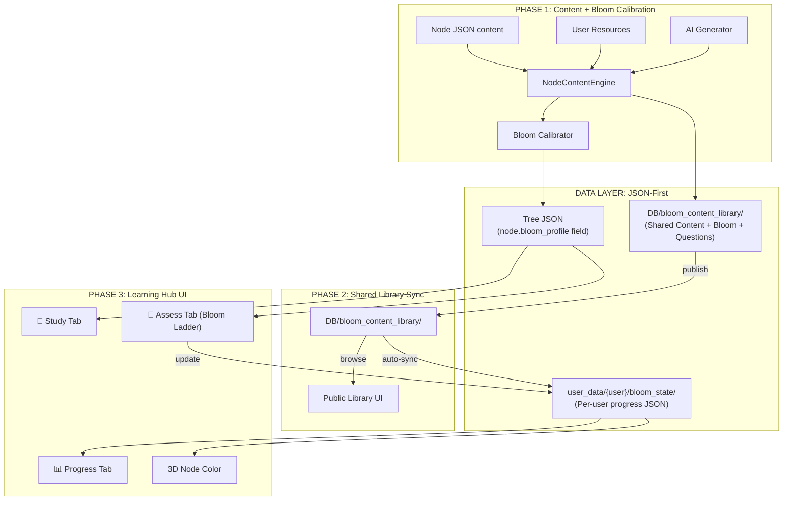

# HỆ THỐNG HỌC TẬP & ĐÁNH GIÁ BLOOM TOÀN DIỆN — TIÊU CHUẨN MIT (v2)

## Bối cảnh & Mục tiêu

Xây dựng hệ thống học tập cấp đại học quốc tế tại mỗi **node** của Cây Tri Thức, kết hợp:
- **Nội dung học tập** (tài liệu, slide, video, AI-generated content)
- **Đánh giá đa dạng** ánh xạ theo thang Bloom 6 bậc
- **Tô màu node 3D** phản ánh chính xác trình độ nhận thức người học
- **JSON-first architecture** — nhẹ, scalable, hỗ trợ nhiều user đồng thời
- **Shared Content Library** — nội dung AI chia sẻ qua thư viện chung, auto-sync

Nguyên tắc thiết kế: **Constructive Alignment** (John Biggs) — Mục tiêu học → Hoạt động học → Đánh giá phải liên kết chặt chẽ.

---

## Quyết định đã được phê duyệt

| # | Quyết định | Kết quả |
|---|---|---|
| 1 | Bloom tự động theo yêu cầu môn học | ✅ AI tự thiết lập, user có thể điều chỉnh lên |
| 2 | Cache AI vào JSON | ✅ Toàn bộ dữ liệu + trạng thái = JSON files |
| 3 | Chia sẻ lên thư viện chung | ✅ Publish → public library → auto-sync cho users khác |
| 4 | Hợp nhất 2 hệ thống mastery | ✅ Unified JSON-based Bloom mastery system |

---

## Proposed Changes

### Kiến trúc tổng thể



---

### PHASE 0: JSON Schema Design (Nền tảng)

#### Thiết kế JSON nhẹ, multi-user scalable

**A. Bloom Content Pack** (chia sẻ được — 1 file per node, lưu tại `DB/bloom_content_library/`)

```json
{
    "node_id": "c1.1",
    "course_id": "aiud_2026",
    "version": 2,
    "updated_at": "2026-04-23T08:00:00",
    "author": "thanhthangbmt7",

    "study_material": {
        "learning_objectives": ["CLO1: ...", "CLO2: ..."],
        "key_concepts": [
            {"term": "Khai phá dữ liệu", "definition": "..."}
        ],
        "detailed_content": "## Markdown content...",
        "summary": "Tóm tắt ngắn...",
        "practical_examples": ["Ví dụ 1...", "Ví dụ 2..."]
    },

    "bloom_profile": {
        "auto_calibrated_levels": [1, 2, 3],
        "user_adjusted_levels": null,
        "effective_levels": [1, 2, 3],
        "calibration_method": "alpha_base",
        "alpha_base": 15
    },

    "question_bank": {
        "L1": [
            {
                "type": "mcq_recall",
                "question": "Đâu là...?",
                "options": ["A", "B", "C", "D"],
                "correct_index": 0,
                "explanation": "..."
            },
            {
                "type": "flashcard",
                "front": "Thuật ngữ X",
                "back": "Định nghĩa X"
            }
        ],
        "L2": [
            {
                "type": "matching",
                "matches": [{"term": "A", "definition": "1"}]
            },
            {
                "type": "fill_blank",
                "content": "...[BLANK]...",
                "answers": ["keyword"]
            }
        ],
        "L3": [{"type": "scenario_mcq", "...": "..."}],
        "L4": [{"type": "socratic_prompt", "initial_question": "..."}],
        "L5": [{"type": "debate_prompt", "position": "..."}],
        "L6": [{"type": "design_task", "task": "..."}]
    }
}
```

**B. User Bloom State** (riêng per user — lưu tại `user_data/{user}/bloom_state/{subject_id}.json`)

```json
{
    "subject_id": "aiud_2026",
    "nodes": {
        "c1.1": {
            "bloom_scores": {
                "L1": {"correct": 8, "total": 10, "score": 0.8, "types_done": ["mcq", "flashcard"]},
                "L2": {"correct": 3, "total": 5, "score": 0.6, "types_done": ["matching"]},
                "L3": {"correct": 0, "total": 0, "score": 0.0, "types_done": []}
            },
            "overall_bloom": 2.1,
            "highest_unlocked": 2,
            "last_activity": "2026-04-23T08:30:00",
            "study_completed": true,
            "total_time_sec": 1200
        }
    },
    "ebbinghaus": {
        "c1.1": {"last_review": 1745369400, "strength": 6.0, "retention": 0.92}
    }
}
```

**Tại sao JSON-first:**
- Không cần database server → chạy được trên mọi máy
- Mỗi user = 1 file nhỏ → không tranh chấp lock
- Dễ backup, migrate, chia sẻ
- Read-heavy workload (đọc nhiều, ghi ít) → JSON tối ưu

---

### PHASE 1: Node Content Engine + Bloom Calibration

#### [NEW] node_content_engine.py

```python
class NodeContentEngine:
    LIBRARY_DIR = "DB/bloom_content_library"

    def get_content(self, node_id, tree_path, username):
        """
        Luồng ưu tiên:
        1. Kiểm tra shared library (DB/bloom_content_library/{course_id}/{node_id}.json)
        2. Nếu có → dùng luôn (miễn phí, không tốn AI)
        3. Nếu không → AI generate → cache vào user dir → option publish lên library
        """

    def auto_calibrate_bloom(self, node_info, course_context):
        """
        AI tự động gán Bloom levels dựa trên yêu cầu môn học:
        - Phân tích course_name + node title + content
        - Xem xét alpha_base, vị trí trong curriculum
        - Output: target_levels = [1, 2, 3]
        User có thể điều chỉnh lên (không xuống) qua UI
        """

    def publish_to_library(self, node_id, course_id, content_pack):
        """Chia sẻ content pack lên thư viện chung"""
        path = f"{self.LIBRARY_DIR}/{course_id}/{node_id}.json"
        # Ghi file JSON → available cho tất cả users

    def sync_from_library(self, tree_path, course_id):
        """Auto-sync: quét thư viện chung, cập nhật nodes chưa có content"""
```

**Luồng Auto-Sync:**
```
User mở node → check library → có? → load → done
                              → không? → AI generate → save local
                                       → user click "Publish" → save to library
                                       → HOẶC auto-publish nếu setting cho phép

User B mở cùng node → check library → CÓ (từ User A) → load → done (0 API calls)
```

---

### PHASE 2: Bloom Taxonomy Framework

#### [NEW] bloom_taxonomy.py

Giữ nguyên BLOOM_LEVELS config từ plan trước. Bổ sung:

```python
def calibrate_node_bloom(node, course_config):
    """
    Auto-calibration từ yêu cầu môn học:
    1. course_config.bloom_requirements → mapping chương → target levels
    2. Fallback: alpha_base heuristic
    3. Lưu vào node JSON, trường bloom_profile
    4. User có thể nâng lên (VD: từ [1,2] → [1,2,3]) nhưng KHÔNG hạ xuống
    """

def user_adjust_bloom(node_id, tree_path, new_levels, current_levels):
    """
    Cho phép user điều chỉnh:
    - new_levels phải là superset hoặc equal current_levels
    - Lưu vào bloom_profile.user_adjusted_levels
    - effective_levels = user_adjusted_levels or auto_calibrated_levels
    """
```

---

### PHASE 3: Assessment Engine + Bloom Ladder

#### [MODIFY] quiz_page.py (Major rewrite)

Giữ nguyên giao diện Bloom Ladder từ plan trước. Thay đổi chính:
- Đọc question_bank từ JSON content pack (không gọi AI real-time nếu đã cache)
- Ghi kết quả vào user bloom_state JSON
- Progressive unlock: L(n) ≥ 70% + ≥ 2 loại đánh giá → mở L(n+1)

---

### PHASE 4: Unified Mastery System

#### [MODIFY] knowledge_tracing.py — HỢP NHẤT

Thay thế hệ thống cũ bằng **JSON-based Bloom mastery**:

```python
def update_bloom_mastery(user_id, subject_id, node_id, bloom_level, 
                         is_correct, assessment_type):
    """
    Unified mastery update:
    1. Đọc user bloom_state JSON
    2. Cập nhật bloom_scores[Lx]
    3. Tính overall_bloom (weighted average)
    4. Áp dụng Ebbinghaus decay
    5. Ghi lại JSON
    """

def get_node_bloom_score(user_id, subject_id, node_id):
    """Trả về overall_bloom 0.0-6.0 cho 3D visualization"""
```

#### [MODIFY] pkt_engine.py

- `calculate_inferred_bloom()` → delegate sang `knowledge_tracing.get_node_bloom_score()`
- `sync_to_json()` → đọc từ bloom_state JSON thay vì tính từ Elo
- Giữ Elo cho backward compatibility nhưng Bloom score là primary

#### [MODIFY] step2_5_visualize_tree.py

- `bloom_map` đọc từ bloom_state JSON thay vì pkt_engine
- Color mapping giữ nguyên (đã đúng chuẩn HSL)

---

### PHASE 5: Shared Library & Auto-Sync

#### [NEW] DB/bloom_content_library/ (Directory structure)

```
DB/bloom_content_library/
├── index.json              ← Catalog: list of all available content packs
├── aiud_2026/
│   ├── c1.1.json          ← Content pack for node c1.1
│   ├── c1.2.json
│   └── ...
├── word_basic/
│   ├── wb_1.json
│   └── ...
└── tmdt_2026/
    ├── Chuong_1_Tiet_1.json
    └── ...
```

#### [MODIFY] resource_sync.py — Bổ sung bloom content sync

```python
def sync_bloom_content_to_tree(tree_path):
    """
    Quét qua tất cả nodes trong tree:
    - Nếu node chưa có bloom content pack → check library
    - Nếu library có → copy vào user space
    - Nếu library không có → flag để AI generate khi user mở node
    """
```

#### UI: Publish button trong Bloom Hub

Khi user tạo xong content (AI-generated hoặc tự viết):
- Nút "📤 Chia sẻ lên thư viện" → ghi vào `DB/bloom_content_library/`
- Tự động cập nhật `index.json`
- User khác mở cùng node → load từ library (0 AI cost)

---

### PHASE 6: Bridge Fix (3D → Bloom Hub)

Giữ nguyên từ plan trước:
- Nút QUIZ trên 3D → mở popup Bloom Hub
- Gộp 4 nút action thành 2: 📺 VIDEO | 📚 BLOOM HUB

---

## Verification Plan

### Automated Tests
1. Tạo node mới không có content → verify AI generate + cache JSON
2. Publish content → verify xuất hiện trong library
3. User B mở cùng node → verify load từ library (không gọi AI)
4. Làm quiz L1 → verify bloom_state JSON cập nhật đúng
5. Đạt L1 ≥ 70% → verify L2 unlock
6. User điều chỉnh Bloom lên [1,2,3,4] → verify lưu đúng

### Manual Verification (Browser)
1. Click node 3D → mở Bloom Hub → 3 tab hoạt động
2. Hoàn thành L1+L2 → verify node đổi màu trên 3D
3. Verify Ebbinghaus decay: chờ 5 phút → bloom score giảm nhẹ

---

## Tóm tắt Files thay đổi

| File | Hành động | Mức thay đổi |
|---|---|---|
| `node_content_engine.py` | **[NEW]** Content + Bloom calibration + Library sync | Toàn bộ |
| `bloom_taxonomy.py` | **[NEW]** Bloom levels config + calibration logic | Toàn bộ |
| `DB/bloom_content_library/` | **[NEW]** Shared content directory | Toàn bộ |
| `quiz_page.py` | **[MODIFY]** → Bloom Learning Hub (3 tabs) | Lớn |
| `knowledge_tracing.py` | **[MODIFY]** Unified Bloom mastery (JSON-based) | Lớn |
| `pkt_engine.py` | **[MODIFY]** Delegate bloom to knowledge_tracing | Trung bình |
| `resource_sync.py` | **[MODIFY]** Add bloom content sync | Trung bình |
| `main.py` | **[MODIFY]** Bridge fix (quiz → bloom hub popup) | Nhỏ |
| `step2_5_visualize_tree.py` | **[MODIFY]** Read bloom from JSON + action buttons | Nhỏ |

**Ước lượng:** 3-4 phiên (Phase 0+1 → Phase 2+3 → Phase 4+5 → Phase 6 + Testing)
