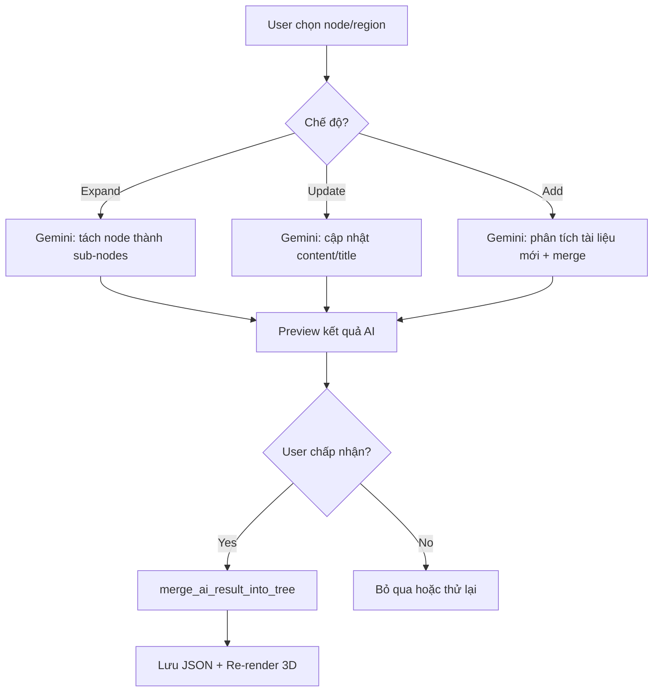

# Hỗ trợ Upload PDF/DOCX & Chỉnh sửa Cây Tri Thức (có AI)

## Bối cảnh
Hệ thống **Creator Hub** hiện chỉ hỗ trợ `.txt`. Cần mở rộng cho `.pdf/.docx` và thêm Tree Editor có tích hợp AI để refine node.

---

## Proposed Changes

### 1. Document Parser Module

#### [NEW] [document_parser.py](file:///I:/MY_CODE/WebPersionalLearning/document_parser.py)

Module trích xuất text từ `.txt`, `.pdf` (pypdf - đã có), `.docx` (python-docx - cần cài). Hàm chính: `parse_document(filename, content_bytes) -> str`, auto-detect extension, giới hạn 15,000 ký tự.

---

### 2. AI Node Refinement Engine

#### [NEW] [tree_editor_ai.py](file:///I:/MY_CODE/WebPersionalLearning/tree_editor_ai.py)

Module chứa các hàm gọi Gemini để chỉnh sửa cây thông minh. Tất cả trả về JSON chuẩn để merge vào cây hiện tại.

```python
def ai_expand_node(existing_tree, target_node_id, user_prompt, extra_document_text=None):
    """
    Tách nhỏ 1 micro_node thành nhiều micro_nodes con chi tiết hơn.
    - existing_tree: toàn bộ cây JSON hiện tại (context)
    - target_node_id: node cần expand (vd "c1.1")
    - user_prompt: yêu cầu của người dùng (vd "Tách bài này thành 3 phần chi tiết hơn")
    - extra_document_text: nội dung tài liệu bổ sung (optional)
    Returns: {"new_micro_nodes": [...], "new_assess_nodes": [...], "new_edges": [...]}
    """

def ai_update_node(existing_tree, target_node_id, user_prompt, extra_document_text=None):
    """
    Cập nhật nội dung 1 node (title, content, assess) dựa trên prompt/tài liệu mới.
    Returns: {"updated_node": {...}, "updated_assess": {...}}
    """

def ai_refine_region(existing_tree, macro_node_id, user_prompt, extra_document_text=None):
    """
    Làm chi tiết toàn bộ 1 chương (macro region) — thêm micro mới, cập nhật edges.
    Returns: {"new_micro_nodes": [...], "new_assess_nodes": [...], "new_edges": [...]}
    """

def ai_add_from_document(existing_tree, document_text, user_prompt):
    """
    Phân tích tài liệu bổ sung và merge vào cây hiện tại (thêm chương mới hoặc bổ sung micro).
    Returns: {"new_macro_nodes": [...], "new_micro_nodes": [...], "new_assess_nodes": [...], "new_edges": [...]}
    """

def merge_ai_result_into_tree(tree_data, ai_result, target_node_id=None):
    """
    Utility: Merge kết quả AI vào tree_data, xử lý trùng ID, cập nhật parent_macro.
    Returns: updated tree_data
    """
```

**Luồng Gemini prompt**: Gửi context cây hiện tại (rút gọn) + node/region mục tiêu + prompt người dùng + tài liệu bổ sung → yêu cầu AI trả JSON chuẩn → merge vào cây.

---

### 3. Creator Hub — Upload + Tree Editor + AI

#### [MODIFY] [main.py](file:///I:/MY_CODE/WebPersionalLearning/main.py)

**Step 1 (~dòng 2082-2211):**
- Upload: `accept=".txt"` → `accept=".txt,.pdf,.docx"`
- Handler: dùng `document_parser.parse_document()` thay `decode('utf-8')`
- Info Card: cập nhật tips cho PDF/DOCX

**Step 2 (~dòng 2212-2260) — Thêm Tree Editor:**

Bổ sung nút **"✏️ Chỉnh sửa cây"** mở dialog full-screen với 3 tab:

**Tab 1: Chỉnh sửa thủ công**
- Sửa tên khóa học, thêm/sửa/xóa macro/micro/assess/edge

**Tab 2: 🤖 AI Refine Node** ← _TÍNH NĂNG MỚI_

```
┌──────────────────────────────────────────────────────────────┐
│  🤖 AI Refine — Dùng AI để làm chi tiết cây tri thức       │
├──────────────────────────────────────────────────────────────┤
│                                                              │
│  🎯 Phạm vi tác động:                                       │
│  ○ Toàn bộ cây    ○ Chương: [▼ m1 - Tổng quan]             │
│  ○ Bài học cụ thể: [▼ c1.1 - Khái niệm TMĐT]              │
│                                                              │
│  📝 Yêu cầu cho AI:                                         │
│  ┌──────────────────────────────────────────────────────┐   │
│  │ Tách bài "Khái niệm TMĐT" thành 3 bài nhỏ hơn:    │   │
│  │ 1. Định nghĩa, 2. Phân loại B2B/B2C/C2C,           │   │
│  │ 3. Lợi ích và hạn chế                               │   │
│  └──────────────────────────────────────────────────────┘   │
│                                                              │
│  📎 Tài liệu bổ sung (tùy chọn):                           │
│  [Kéo thả file .txt, .pdf, .docx]                           │
│                                                              │
│  Chế độ:                                                     │
│  ○ Expand (tách nhỏ node thành nhiều sub-nodes)             │
│  ○ Update (cập nhật nội dung node hiện tại)                 │
│  ○ Add (thêm nội dung mới từ tài liệu vào cây)            │
│                                                              │
│  [🚀 Gửi cho AI xử lý]                                     │
│                                                              │
│  ── Kết quả AI (preview trước khi áp dụng) ──              │
│  ┌──────────────────────────────────────────────────────┐   │
│  │ AI đề xuất tách c1.1 thành:                         │   │
│  │  • c1.1a: Định nghĩa TMĐT (alpha: 10)              │   │
│  │  • c1.1b: Phân loại B2B/B2C/C2C (alpha: 12)        │   │
│  │  • c1.1c: Lợi ích và hạn chế (alpha: 14)           │   │
│  │ + 3 assess nodes, 2 edges mới                       │   │
│  └──────────────────────────────────────────────────────┘   │
│                                                              │
│  [✅ Áp dụng thay đổi]  [❌ Bỏ qua]  [🔄 Thử lại]        │
└──────────────────────────────────────────────────────────────┘
```

**Tab 3: Edges & Tổng quan** — xem/sửa edges, thống kê cây

**Bottom bar:** `[Hủy bỏ]` `[💾 Lưu & Cập nhật 3D]`

---

### 4. Onboarding Wizard

#### [MODIFY] [onboarding.py](file:///I:/MY_CODE/WebPersionalLearning/onboarding.py)

- Upload accept → `.txt,.pdf,.docx`
- Handler dùng `document_parser.parse_document()`

---

### 5. Dependencies

#### [MODIFY] [requirements.txt](file:///I:/MY_CODE/WebPersionalLearning/requirements.txt)

Thêm `python-docx`

---

## Luồng xử lý AI Refine



**Nguyên tắc thiết kế:**
1. AI luôn trả JSON chuẩn (dùng `response_mime_type="application/json"`)
2. User luôn preview trước khi apply — không tự động ghi đè
3. ID mới được auto-generate không trùng ID cũ
4. Edges cũ liên quan đến node bị tách sẽ được AI tự động re-map

---

## Verification Plan

### Automated Tests
1. Unit test `document_parser.py` — parse `.txt`, `.pdf`, `.docx`
2. Unit test `tree_editor_ai.py` — mock Gemini response, test merge logic
3. Browser test: upload PDF/DOCX → cây được tạo thành công
4. Browser test: Tree Editor → AI Expand node → preview → apply → 3D re-render

### Manual Verification
- Kiểm tra giao diện Tree Editor trên trình duyệt
- Onboarding vẫn hoạt động với PDF/DOCX

---

> [!IMPORTANT]
> `python-docx` cần cài thêm: `pip install python-docx`

> [!NOTE]
> `pypdf` đã có sẵn (pypdf==6.7.0)
