# Kế hoạch triển khai theo giai đoạn — Upload PDF/DOCX & Tree Editor AI

> Mỗi giai đoạn hoàn chỉnh, kiểm tra được độc lập trước khi sang giai đoạn tiếp theo.

---

## Phase 1: Document Parser Module

**Mục tiêu:** Tạo module `document_parser.py` trích xuất text từ `.txt`, `.pdf`, `.docx`

### Việc cần làm

| # | Công việc | File |
|---|---|---|
| 1.1 | Cài `python-docx` | Terminal |
| 1.2 | Tạo `document_parser.py` với 4 hàm: `parse_txt()`, `parse_pdf()`, `parse_docx()`, `parse_document()` | [NEW] `document_parser.py` |
| 1.3 | Thêm `python-docx` vào `requirements.txt` | [MODIFY] `requirements.txt` |
| 1.4 | Tạo script test | [NEW] `tests/test_document_parser.py` |

### Chi tiết `document_parser.py`

```python
parse_txt(content_bytes: bytes) -> str
  # decode UTF-8, fallback latin-1

parse_pdf(content_bytes: bytes) -> str
  # dùng pypdf.PdfReader, đọc từng page, nối text

parse_docx(content_bytes: bytes) -> str
  # dùng docx.Document, đọc từng paragraph, nối text

parse_document(filename: str, content_bytes: bytes, max_chars=15000) -> str
  # auto-detect theo extension, gọi hàm tương ứng, cắt max_chars
```

### Kiểm tra Phase 1

```bash
# 1. Cài dependency
pip install python-docx

# 2. Chạy test script
python tests/test_document_parser.py
```

**Kết quả mong đợi:**
- ✅ Parse file `.txt` → trả text đúng
- ✅ Parse file `.pdf` (dùng file có sẵn trong `DB/`) → trả text
- ✅ Parse file `.docx` (tạo file test đơn giản) → trả text
- ✅ File không hỗ trợ (`.jpg`) → raise lỗi rõ ràng
- ✅ Text bị cắt ≤ 15,000 ký tự

---

## Phase 2: Tích hợp Upload đa định dạng

**Mục tiêu:** Creator Hub Step 1 và Onboarding hỗ trợ upload `.txt`, `.pdf`, `.docx`

### Việc cần làm

| # | Công việc | File | Dòng ước lượng |
|---|---|---|---|
| 2.1 | Import `document_parser` | `main.py` | đầu file |
| 2.2 | Sửa upload component: `accept=".txt,.pdf,.docx"` | `main.py` | ~2162 |
| 2.3 | Sửa label upload: `'Kéo thả file .txt, .pdf, .docx'` | `main.py` | ~2162 |
| 2.4 | Sửa handler `handle_upload_txt`: dùng `parse_document()` | `main.py` | ~2098-2110 |
| 2.5 | Sửa Info Card tips → phản ánh PDF/DOCX | `main.py` | ~2196-2210 |
| 2.6 | Sửa Onboarding: accept + handler | `onboarding.py` | ~92, 107, 119-122 |

### Chi tiết sửa handler (main.py ~2098-2110)

```python
# TRƯỚC:
content = content_bytes.decode('utf-8')

# SAU:
from document_parser import parse_document
content = parse_document(filename, content_bytes)
```

### Kiểm tra Phase 2

1. **Khởi chạy app:** `python main.py`
2. **Mở browser** → đăng nhập → vào tab **Creator Hub**
3. **Test từng loại file:**

| Test | File upload | Kết quả mong đợi |
|---|---|---|
| 2a | Upload file `.txt` (test_doc.txt) | ✅ AI tạo cây thành công (như cũ) |
| 2b | Upload file `.pdf` | ✅ AI tạo cây, hiển thị thống kê Chương/Bài/Kiểm tra |
| 2c | Upload file `.docx` | ✅ AI tạo cây tương tự |
| 2d | Upload file `.jpg` | ❌ Thông báo lỗi "Không hỗ trợ định dạng" |
| 2e | Onboarding: upload `.pdf` | ✅ Chuyển sang Step 2 thành công |

---

## Phase 3: Tree Editor — Chỉnh sửa thủ công

**Mục tiêu:** Dialog full-screen cho phép chỉnh sửa thủ công cây tri thức (không có AI)

### Việc cần làm

| # | Công việc | File |
|---|---|---|
| 3.1 | Tạo module `tree_editor_ui.py` chứa hàm `open_tree_editor(json_path, on_save_callback)` | [NEW] `tree_editor_ui.py` |
| 3.2 | Thêm nút "✏️ Chỉnh sửa cây" vào Step 2 actions | [MODIFY] `main.py` ~2252-2256 |

### Chi tiết `tree_editor_ui.py`

Hàm chính: `open_tree_editor(json_path, username, on_save_callback)`

**Layout dialog full-screen:**

```
┌─ Header ──────────────────────────────────────────────┐
│ ✏️ Chỉnh sửa: [course_name input]     [❌ Đóng]     │
├─ Left Panel (30%) ─┬─ Right Panel (70%) ──────────────┤
│ 📌 m1 - Tổng quan  │                                  │
│   ├ c1.1 Khái niệm │  [Chi tiết node đang chọn]      │
│   ├ c1.2 Cơ sở HT  │  Title: [____]                  │
│   └ c1.3 Mô hình   │  Content: [________]            │
│ 📌 m2 - Giao dịch  │  Alpha: [__]                    │
│   ├ c2.1            │  Parent: [▼ macro]              │
│   └ c2.2            │                                  │
│                     │  Câu hỏi kiểm tra:              │
│ [+ Thêm Chương]    │  Q1: [____] Ans: [▼]            │
│                     │  [+ Thêm câu hỏi]              │
│                     │                                  │
│                     │  Edges liên quan:                │
│                     │  c1.1 → c1.2 [🗑️]              │
│                     │  [+ Thêm edge]                  │
├─────────────────────┴──────────────────────────────────┤
│ Thống kê: 5 Chương · 10 Bài · 8 Kiểm tra · 12 Edges │
│                          [Hủy]  [💾 Lưu & Cập nhật 3D]│
└────────────────────────────────────────────────────────┘
```

**Các thao tác cần implement:**

| Nhóm | Thao tác |
|---|---|
| Course | Sửa tên `course_name` |
| Macro | Thêm / Sửa title / Xóa (kèm cascade micro+assess+edge) |
| Micro | Thêm (chọn parent) / Sửa title+content+alpha+parent / Xóa (cascade) |
| Assess | Thêm (liên kết micro) / Sửa question+options+answer / Xóa |
| Edge | Thêm (chọn source+target) / Xóa |

**Khi "Lưu & Cập nhật 3D":**
1. Ghi JSON vào file
2. Gọi `visualize_knowledge_tree()` để re-render HTML
3. Refresh iframe 3D trong Step 2
4. Đóng dialog

### Kiểm tra Phase 3

1. **Khởi chạy app** → Creator Hub → upload `.txt` → đợi AI tạo cây
2. **Ở Step 2**: nhấn **"✏️ Chỉnh sửa cây"**

| Test | Thao tác | Kết quả mong đợi |
|---|---|---|
| 3a | Mở dialog | ✅ Hiện danh sách chương+bài bên trái, chi tiết bên phải |
| 3b | Sửa tên khóa học | ✅ Input hiện tên cũ, sửa được |
| 3c | Click node c1.1 | ✅ Hiện title, content, alpha, parent, assess, edges |
| 3d | Sửa title node → Lưu | ✅ JSON cập nhật, 3D re-render đúng tên mới |
| 3e | Thêm Chương mới | ✅ Xuất hiện macro mới trong tree, ID tự sinh |
| 3f | Thêm Bài mới vào Chương | ✅ Micro mới xuất hiện, có parent đúng |
| 3g | Xóa 1 bài → Lưu | ✅ Bài biến mất, assess+edge liên quan cũng xóa |
| 3h | Thêm edge c2.1→c3.1 → Lưu | ✅ Edge mới hiện trong cây |
| 3i | Thêm câu hỏi assess → Lưu | ✅ Assess node mới hoặc question mới được thêm |
| 3j | Nhấn Hủy | ✅ Không thay đổi gì, dialog đóng |

---

## Phase 4: AI Refinement Engine (Backend)

**Mục tiêu:** Module `tree_editor_ai.py` — gọi Gemini để expand/update/add nodes

### Việc cần làm

| # | Công việc | File |
|---|---|---|
| 4.1 | Tạo `tree_editor_ai.py` với 5 hàm | [NEW] `tree_editor_ai.py` |
| 4.2 | Tạo test script | [NEW] `tests/test_tree_editor_ai.py` |

### Chi tiết `tree_editor_ai.py`

**Hàm 1: `ai_expand_node(tree, node_id, prompt, doc_text=None)`**
- Prompt Gemini: "Đây là cây tri thức hiện tại. Hãy tách node {node_id} thành nhiều node nhỏ hơn theo yêu cầu: {prompt}. Nếu có tài liệu bổ sung, dùng nó để tạo nội dung chi tiết hơn."
- Gemini trả JSON: `{"new_micro_nodes": [...], "new_assess_nodes": [...], "new_edges": [...]}`
- Node gốc sẽ bị thay thế bởi các node mới

**Hàm 2: `ai_update_node(tree, node_id, prompt, doc_text=None)`**
- Prompt: "Cập nhật nội dung node {node_id} theo yêu cầu: {prompt}"
- Gemini trả: `{"updated_node": {title, content, alpha_base}, "updated_assess": {questions}}`

**Hàm 3: `ai_refine_region(tree, macro_id, prompt, doc_text=None)`**
- Prompt: "Làm chi tiết toàn bộ chương {macro_id}, thêm micro nodes mới"
- Gemini trả: `{"new_micro_nodes": [...], "new_assess_nodes": [...], "new_edges": [...]}`

**Hàm 4: `ai_add_from_document(tree, doc_text, prompt)`**
- Prompt: "Phân tích tài liệu mới và merge vào cây hiện tại"
- Gemini trả: `{"new_macro_nodes": [...], "new_micro_nodes": [...], "new_assess_nodes": [...], "new_edges": [...]}`

**Hàm 5: `merge_ai_result_into_tree(tree, result, target_node_id=None)`**
- Pure Python, không gọi AI
- Xử lý: dedup ID, cập nhật parent_macro, xóa node gốc (nếu expand), append edges mới

### Kiểm tra Phase 4

```bash
python tests/test_tree_editor_ai.py
```

| Test | Thao tác | Kết quả mong đợi |
|---|---|---|
| 4a | `ai_expand_node(tree, "c1.1", "Tách thành 3 phần")` | ✅ Gemini trả JSON hợp lệ, có ≥2 new_micro_nodes |
| 4b | `ai_update_node(tree, "c1.1", "Thêm ví dụ thực tế")` | ✅ updated_node có content dài hơn/khác |
| 4c | `ai_refine_region(tree, "m1", "Thêm 2 bài mới")` | ✅ new_micro_nodes có ≥2 phần tử |
| 4d | `ai_add_from_document(tree, doc_text, "Bổ sung chương mới")` | ✅ Có new_macro_nodes hoặc new_micro_nodes |
| 4e | `merge_ai_result_into_tree(tree, result, "c1.1")` | ✅ tree cập nhật, không trùng ID, edges đúng |
| 4f | Merge expand: node gốc c1.1 bị thay thế | ✅ c1.1 không còn, có c1.1a, c1.1b... thay thế |

---

## Phase 5: AI Refine Tab trong Tree Editor UI

**Mục tiêu:** Thêm Tab "🤖 AI Refine" vào Tree Editor dialog

### Việc cần làm

| # | Công việc | File |
|---|---|---|
| 5.1 | Thêm tab "🤖 AI Refine" vào `tree_editor_ui.py` | [MODIFY] `tree_editor_ui.py` |
| 5.2 | Tab chứa: chọn phạm vi, nhập prompt, upload tài liệu, chọn chế độ, nút gửi AI |
| 5.3 | Khu vực preview kết quả AI + nút Áp dụng / Bỏ qua / Thử lại |
| 5.4 | Kết nối với `tree_editor_ai.py` backend |

### UI Tab AI Refine

**Phần 1 — Input:**
- Radio chọn phạm vi: `Toàn bộ cây` / `Chương [▼ select]` / `Bài học [▼ select]`
- Textarea: prompt yêu cầu cho AI
- Upload component: file bổ sung `.txt/.pdf/.docx` (tùy chọn)
- Radio chọn chế độ: `Expand` / `Update` / `Add`
- Nút `🚀 Gửi cho AI xử lý`

**Phần 2 — Preview:**
- Spinner loading khi AI đang xử lý
- Hiển thị kết quả dạng danh sách: nodes mới, edges mới, thay đổi
- 3 nút: `✅ Áp dụng` / `❌ Bỏ qua` / `🔄 Thử lại`

**Khi "Áp dụng":**
1. Gọi `merge_ai_result_into_tree()`
2. Cập nhật tree view bên Tab 1
3. Hiện toast thành công
4. User có thể tiếp tục refine hoặc Lưu & Cập nhật 3D

### Kiểm tra Phase 5

1. **Khởi chạy app** → Creator Hub → tạo cây mới → Step 2 → Chỉnh sửa cây
2. **Chuyển sang tab "🤖 AI Refine"**

| Test | Thao tác | Kết quả mong đợi |
|---|---|---|
| 5a | Chọn node c1.1, mode Expand, nhập "Tách thành 3 phần" → Gửi AI | ✅ Spinner → Preview hiện 3 node mới |
| 5b | Nhấn "Áp dụng" | ✅ Tab 1 cập nhật tree, c1.1 thay bằng nodes mới |
| 5c | Chọn chương m1, mode Add, upload file .pdf → Gửi AI | ✅ Preview hiện micro nodes mới trích từ PDF |
| 5d | Nhấn "Bỏ qua" | ✅ Không thay đổi gì |
| 5e | Nhấn "Thử lại" | ✅ Gọi AI lần nữa, kết quả khác |
| 5f | Chọn node, mode Update, nhập "Thêm ví dụ Amazon" → Gửi AI | ✅ Preview hiện content mới, nhấn Áp dụng → cập nhật |
| 5g | Sau nhiều lần refine → nhấn "💾 Lưu & Cập nhật 3D" | ✅ JSON lưu, 3D re-render, dialog đóng |

---

## Tổng quan giai đoạn

```mermaid
gantt
    title Phân chia giai đoạn triển khai
    dateFormat X
    axisFormat %s
    section Phase 1
    document_parser.py + test    :p1, 0, 1
    section Phase 2
    Upload đa định dạng (main.py + onboarding) :p2, 1, 2
    section Phase 3
    Tree Editor thủ công (tree_editor_ui.py)   :p3, 2, 4
    section Phase 4
    AI Engine (tree_editor_ai.py + test)       :p4, 4, 5
    section Phase 5
    AI Refine Tab trong UI                     :p5, 5, 6
```



| Phase | Files tạo/sửa | Có thể test độc lập? |
|---|---|---|
| 1 | `document_parser.py` (NEW), `requirements.txt` | ✅ Chạy test script |
| 2 | `main.py`, `onboarding.py` | ✅ Upload file trong browser |
| 3 | `tree_editor_ui.py` (NEW), `main.py` | ✅ Mở editor, sửa, lưu |
| 4 | `tree_editor_ai.py` (NEW) | ✅ Chạy test script |
| 5 | `tree_editor_ui.py` | ✅ Dùng AI refine trong browser |
