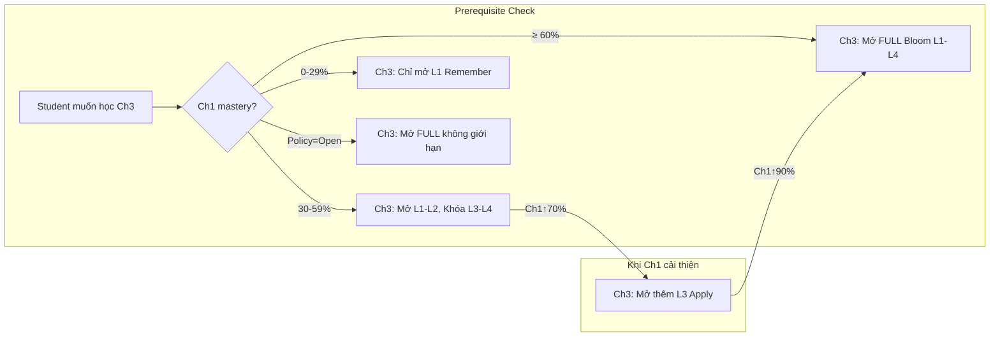
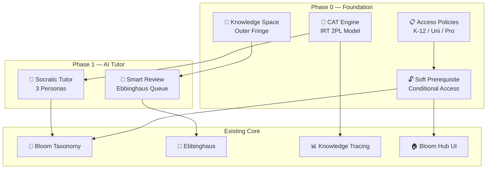

# 🎓 TutorAI Bio-Tree — Kế hoạch Phát triển AI Tutor (MIT-Standard)

## Bối cảnh & Mục tiêu

Dựa trên **PLiF (Fake & Dabbagh, 2023)**, **IRT (Item Response Theory)**, và **Knowledge Space Theory (Doignon & Falmagne, 1999)**, kế hoạch này nâng cấp hệ thống từ quiz đúng/sai đơn giản lên **AI Tutor toàn diện** với CAT adaptive testing, Soft Prerequisite, và đa ngữ cảnh giáo dục.

### Gap Analysis: Hiện tại vs. Mục tiêu

| Tính năng | Hiện tại | Mục tiêu |
|---|---|---|
| Prerequisite | Hard Lock (phải hoàn thành Ch1 mới mở Ch3) | **Soft Lock** (Ch3 mở ở Bloom giới hạn) |
| Đánh giá | MCQ cố định, random | **CAT adaptive** (IRT 2PL, chọn item tối ưu) |
| Access Policy | Một chính sách duy nhất | **3 profiles** (K-12, Đại học, Chuyên nghiệp) |
| AI Tutor | Chat chung | **Socratic Dialog** theo Bloom persona |
| Ôn tập | Ebbinghaus tính nhưng chưa push | **Smart Review Queue** |
| Đa môn | Chỉ 1 môn/lần | **Dashboard tổng hợp** |

---

## User Review Required

> [!IMPORTANT]
> **Phase 0 (CAT + Soft Prerequisite)** là nền tảng bắt buộc trước khi triển khai Phase 1-3. Xác nhận bạn muốn bắt đầu từ Phase 0?

> [!WARNING]
> **Soft Prerequisite thay đổi logic unlock hiện tại** trong `check_level_unlocked()`. Cần đảm bảo backward-compatible với bloom_state đã lưu.

---

## Open Questions

> [!IMPORTANT]
> 1. **Default Access Policy?** Hệ thống mặc định dùng profile nào? (Đề xuất: `university_flexible`)
> 2. **IRT Item Bank:** Dùng AI (Gemini) để auto-calibrate item parameters (a, b) hay manual? (Đề xuất: AI auto-calibrate dựa trên response history)
> 3. **Bloom Ceiling khi skip:** Nếu Ch1 mastery = 0%, Ch3 nên mở tối đa Bloom L1 hay L2? (Đề xuất: L1 only — Remember)

---

## Proposed Changes

### PHASE 0: CAT ENGINE + SOFT PREREQUISITE (Nền tảng)
*Giải quyết vấn đề cốt lõi: học viên đang ở Ch3 nhưng Ch1 chưa hoàn thành.*

---

#### [NEW] [cat_engine.py](file:///i:/MY_CODE/WebPersionalLearning/cat_engine.py)

**Computerized Adaptive Testing Engine** dựa trên IRT 2PL model.

```python
"""
CAT Engine — Computerized Adaptive Testing
Dựa trên Item Response Theory (IRT) 2-Parameter Logistic Model

Mô hình: P(θ) = 1 / (1 + exp(-a(θ - b)))
- θ (theta): Năng lực người học (ước lượng real-time)
- a: Discrimination (độ phân biệt câu hỏi)
- b: Difficulty (độ khó câu hỏi)

Thuật toán CAT:
1. Khởi tạo θ₀ = 0 (trung bình)
2. Chọn item có Fisher Information cao nhất tại θ hiện tại
3. Ghi nhận response → Cập nhật θ bằng EAP (Expected a Posteriori)
4. Lặp lại cho đến khi SE(θ) < threshold hoặc đủ số item
"""

class CATEngine:
    def __init__(self, item_bank: list, prior_theta: float = 0.0):
        self.item_bank = item_bank      # [{id, a, b, bloom_level, content...}]
        self.theta = prior_theta         # Ước lượng năng lực ban đầu
        self.responses = []              # [(item_id, correct: bool)]
        self.administered = set()
        self.se_threshold = 0.3          # Dừng khi SE < 0.3
        self.max_items = 15
    
    def probability(self, theta, a, b) -> float:
        """IRT 2PL: Xác suất trả lời đúng"""
        return 1.0 / (1.0 + math.exp(-a * (theta - b)))
    
    def fisher_information(self, theta, a, b) -> float:
        """Fisher Information tại θ cho 1 item"""
        p = self.probability(theta, a, b)
        return a**2 * p * (1 - p)
    
    def select_next_item(self) -> dict | None:
        """Chọn item tối ưu: Maximum Fisher Information"""
        ...
    
    def update_theta_eap(self) -> float:
        """Cập nhật θ bằng EAP (Bayesian, robust hơn MLE)"""
        # Quadrature points từ -4 đến 4
        ...
    
    def get_standard_error(self) -> float:
        """SE(θ) = 1/√(ΣI(θ)) — Sai số chuẩn"""
        ...
    
    def should_stop(self) -> bool:
        """Dừng khi SE đủ nhỏ hoặc hết item"""
        return (self.get_standard_error() < self.se_threshold 
                or len(self.responses) >= self.max_items)
    
    def get_ability_report(self) -> dict:
        """Báo cáo: θ estimate, SE, bloom_level tương ứng, confidence"""
        ...

class ItemCalibrator:
    """Auto-calibrate item parameters từ response history (dùng Gemini AI)"""
    
    def calibrate_from_history(self, item_id, responses: list) -> dict:
        """Ước lượng a, b từ dữ liệu lịch sử trả lời"""
        ...
    
    def ai_estimate_difficulty(self, question_text, bloom_level) -> dict:
        """Dùng Gemini AI để ước lượng ban đầu a, b cho item mới"""
        ...
```

**Ánh xạ θ → Bloom Level:**

| θ Range | Bloom Level | Ý nghĩa |
|---|---|---|
| θ < -1.5 | L1 (Remember) | Chưa nắm cơ bản |
| -1.5 ≤ θ < -0.5 | L2 (Understand) | Hiểu sơ bộ |
| -0.5 ≤ θ < 0.5 | L3 (Apply) | Áp dụng được |
| 0.5 ≤ θ < 1.5 | L4 (Analyze) | Phân tích tốt |
| 1.5 ≤ θ < 2.5 | L5 (Evaluate) | Đánh giá chuyên sâu |
| θ ≥ 2.5 | L6 (Create) | Sáng tạo |

---

#### [NEW] [soft_prerequisite.py](file:///i:/MY_CODE/WebPersionalLearning/soft_prerequisite.py)

**Soft Prerequisite & Conditional Access** — Thay thế Hard Lock.

```python
"""
Soft Prerequisite System — Conditional Access Policy

VẤN ĐỀ CỐT LÕI:
Sinh viên đang học Chương 3 nhưng Chương 1 chưa hoàn thành.
→ Hard Lock (hiện tại): Khóa hoàn toàn Ch3 → Frustration, dropout
→ Soft Lock (mới): Mở Ch3 nhưng GIỚI HẠN Bloom Level tối đa

CÔNG THỨC BLOOM CEILING:
  max_bloom(node) = min(
      target_bloom_max,                          # Bloom tối đa theo alpha_base
      floor(avg_prereq_mastery × target_max) + 1 # Giới hạn bởi prerequisite
  )

VÍ DỤ:
  Ch1 mastery = 30% (chưa hoàn thành), Ch3 target = [L1, L2, L3, L4]
  → max_bloom(Ch3) = min(4, floor(0.3 × 4) + 1) = min(4, 2) = L2
  → Ch3 chỉ mở L1 (Remember) + L2 (Understand), khóa L3-L4

  Khi Ch1 mastery tăng lên 70%:
  → max_bloom(Ch3) = min(4, floor(0.7 × 4) + 1) = min(4, 3) = L3
  → Ch3 mở thêm L3 (Apply)
"""

# 3 Access Policy Profiles cho đa ngữ cảnh
ACCESS_POLICIES = {
    "k12_strict": {
        "name": "Phổ thông (Nghiêm ngặt)",
        "description": "Tuần tự chặt chẽ, phù hợp K-12",
        "min_prereq_mastery": 0.6,    # Phải đạt ≥60% prereq
        "bloom_ceiling_enabled": True,
        "allow_skip_chapter": False,   # Không cho nhảy chương
        "penalty_multiplier": 2.0,     # Hàm phạt alpha_t cao
        "contexts": ["middle_school", "high_school"]
    },
    "university_flexible": {
        "name": "Đại học (Linh hoạt)",
        "description": "Cho phép học không tuần tự, Bloom ceiling động",
        "min_prereq_mastery": 0.0,    # Luôn cho truy cập
        "bloom_ceiling_enabled": True,
        "allow_skip_chapter": True,    # Cho nhảy chương
        "penalty_multiplier": 1.5,     # Hàm phạt vừa phải
        "cat_placement_test": True,    # Cho thi xếp lớp CAT
        "contexts": ["undergraduate", "graduate", "mit_ocw"]
    },
    "professional_open": {
        "name": "Chuyên nghiệp (Mở)",
        "description": "Tự do hoàn toàn, chỉ gợi ý không chặn",
        "min_prereq_mastery": 0.0,
        "bloom_ceiling_enabled": False, # Không giới hạn Bloom
        "allow_skip_chapter": True,
        "penalty_multiplier": 1.0,
        "contexts": ["corporate_training", "self_learner"]
    }
}

class SoftPrerequisiteEngine:
    def __init__(self, tree_data, bloom_state, policy="university_flexible"):
        self.tree = tree_data
        self.bloom_state = bloom_state
        self.policy = ACCESS_POLICIES[policy]
        self.edges = tree_data.get("edges", [])
    
    def get_prerequisite_nodes(self, node_id) -> list:
        """Tìm tất cả prerequisite nodes (direct + transitive)"""
        ...
    
    def get_prereq_mastery_avg(self, node_id, username) -> float:
        """Tính trung bình mastery của tất cả prerequisite nodes"""
        ...
    
    def calculate_bloom_ceiling(self, node_id, target_levels) -> int:
        """Tính Bloom level tối đa được phép truy cập"""
        if not self.policy["bloom_ceiling_enabled"]:
            return max(target_levels)  # Không giới hạn
        
        avg_mastery = self.get_prereq_mastery_avg(node_id, ...)
        target_max = max(target_levels)
        ceiling = min(target_max, math.floor(avg_mastery * target_max) + 1)
        return max(min(target_levels), ceiling)  # Ít nhất mở L min
    
    def get_access_status(self, node_id, target_levels) -> dict:
        """
        Returns: {
            "accessible": True/False,
            "bloom_ceiling": int,          # Bloom max được phép
            "unlocked_levels": [1, 2],     # Levels thực sự mở
            "locked_levels": [3, 4],       # Levels bị khóa
            "prereq_gaps": [...],          # Prerequisite chưa đạt
            "recommendation": str,         # Gợi ý hành động
            "penalty_alpha": float         # Hệ số phạt năng lượng
        }
        """
        ...
    
    def get_knowledge_space_fringe(self, username) -> list:
        """
        Knowledge Space Theory: Tìm 'outer fringe' — 
        tập node mà người học SẴN SÀNG học tiếp theo.
        Fringe = nodes có ≥80% prereqs đã mastered
        """
        ...

    def run_placement_test(self, username, subject_id) -> dict:
        """
        CAT Placement Test: Xác định θ ban đầu cho toàn khóa.
        Chọn 5-10 item đại diện từ các chương → Ước lượng θ →
        Tự động unlock các chapter phù hợp.
        """
        ...
```

**Minh họa luồng Conditional Access:**



---

#### [MODIFY] [bloom_taxonomy.py](file:///i:/MY_CODE/WebPersionalLearning/bloom_taxonomy.py)

Thay đổi `check_level_unlocked()` để tích hợp Soft Prerequisite:

```diff
-def check_level_unlocked(level: int, level_scores: dict, target_levels: list) -> bool:
+def check_level_unlocked(level: int, level_scores: dict, target_levels: list,
+                          bloom_ceiling: int = 6) -> bool:
     """Kiểm tra xem một mức Bloom có được mở khóa chưa."""
+    # NEW: Soft Prerequisite ceiling check
+    if level > bloom_ceiling:
+        return False
+
     if level == 1:
         return True
     # ... existing logic unchanged ...
```

Thêm hàm mới:

```diff
+def calculate_bloom_ceiling_from_prereqs(node_id, tree_data, bloom_state, 
+                                          policy="university_flexible") -> int:
+    """Tính Bloom ceiling dựa trên prerequisite mastery"""
+    ...

+def map_theta_to_bloom(theta: float) -> int:
+    """Ánh xạ IRT θ estimate → Bloom Level (1-6)"""
+    thresholds = [(-1.5, 1), (-0.5, 2), (0.5, 3), (1.5, 4), (2.5, 5)]
+    for threshold, level in thresholds:
+        if theta < threshold:
+            return level
+    return 6
```

---

#### [MODIFY] [bloom_hub_page.py](file:///i:/MY_CODE/WebPersionalLearning/bloom_hub_page.py)

Tích hợp Bloom Ceiling vào UI:

```diff
 # Trong render_bloom_ladder():
+from soft_prerequisite import SoftPrerequisiteEngine
+spe = SoftPrerequisiteEngine(tree_data, bloom_state)
+access = spe.get_access_status(node_id, target_levels)
+bloom_ceiling = access["bloom_ceiling"]

 for lvl in target_levels:
-    unlocked = check_level_unlocked(lvl, scores, target_levels)
+    unlocked = check_level_unlocked(lvl, scores, target_levels, bloom_ceiling)
+    
+    # NEW: Show ceiling warning for locked-by-prereq levels
+    if lvl > bloom_ceiling:
+        status_icon = '⛔'
+        status_text = f'Cần hoàn thành prerequisite (ceiling: L{bloom_ceiling})'
```

---

#### [MODIFY] [step3_learning_engine.py](file:///i:/MY_CODE/WebPersionalLearning/step3_learning_engine.py)

Tích hợp Access Policy vào hàm phạt alpha:

```diff
-def calculate_alpha_cost(node_id, tree_data, user_state):
+def calculate_alpha_cost(node_id, tree_data, user_state, policy="university_flexible"):
     alpha_base = target_node.get("alpha_base", 10)
+    penalty_multiplier = ACCESS_POLICIES[policy]["penalty_multiplier"]
     ...
-    alpha_t = alpha_base * (1 + LAMBDA_PENALTY * penalty_sum)
+    alpha_t = alpha_base * (1 + penalty_multiplier * penalty_sum)
```

---

#### [MODIFY] [knowledge_tracing.py](file:///i:/MY_CODE/WebPersionalLearning/knowledge_tracing.py)

Thêm CAT-aware state tracking:

```diff
+def get_cat_prior_theta(user_id, subject_id, node_id) -> float:
+    """Lấy θ ước lượng từ lịch sử, dùng làm prior cho CAT session mới"""
+    ...

+def update_theta_from_cat(user_id, subject_id, node_id, theta, se) -> None:
+    """Lưu θ estimate sau CAT session"""
+    ...

+def get_all_subjects_state(user_id) -> dict:
+    """Lấy state tất cả môn học cho Dashboard tổng hợp"""
+    ...
```

---

### PHASE 1: SOCRATIC TUTOR ENGINE
*(Giữ nguyên từ plan trước, bổ sung CAT integration)*

#### [NEW] [socratic_tutor_engine.py](file:///i:/MY_CODE/WebPersionalLearning/socratic_tutor_engine.py)

3 Persona theo Bloom Level:

| Persona | Bloom | Chiến lược |
|---|---|---|
| `examiner` | L1-L2 | Hỏi → Chấm → Giải thích ngắn |
| `socratic_guide` | L3-L4 | Case study → Hỏi gợi mở → Tự phát hiện |
| `devils_advocate` | L5-L6 | Đưa quan điểm sai → Tranh biện → Phê bình design |

**NEW — CAT Integration:** Socratic session sử dụng `CATEngine` để adaptive chọn câu hỏi theo θ thay vì random.

#### [NEW] [smart_review_queue.py](file:///i:/MY_CODE/WebPersionalLearning/smart_review_queue.py)

Priority Score = `(1 - Retention) × Bloom_Weight × Recency_Bonus`

---

### PHASE 2: MULTI-SUBJECT DASHBOARD

#### [NEW] [multi_subject_dashboard.py](file:///i:/MY_CODE/WebPersionalLearning/multi_subject_dashboard.py)

Dashboard tổng hợp: Course Cards + Ebbinghaus Alert + Bloom Radar + Smart Review Widget.

**NEW — Access Policy Selector:** UI cho phép chuyển đổi giữa K-12 Strict / University Flexible / Professional Open.

---

### PHASE 3: SOCIAL LEARNING (PLiF Layer 4-5)

#### [NEW] [social_learning.py](file:///i:/MY_CODE/WebPersionalLearning/social_learning.py)

Peer Review + Study Groups + Community Q&A.

---

## Verification Plan

### Automated Tests

```bash
# Phase 0: CAT + Soft Prerequisite
python -m pytest tests/test_cat_engine.py -v
python -m pytest tests/test_soft_prerequisite.py -v

# Scenario: Student skip Ch1, access Ch3
# Expected: Ch3 opens at L1-L2 only, Ch3 L3-L4 locked
```

### Browser Tests
1. Mở Bloom Hub cho node ở Ch3 khi Ch1 chưa hoàn thành → Verify ceiling badge hiển thị
2. Hoàn thành quiz Ch1 → Verify Ch3 tự động mở thêm Bloom levels
3. Chuyển Access Policy → Verify unlock behavior thay đổi

### Manual Verification
- Test CAT với 10 câu hỏi → Verify θ converge sau 5-7 items
- So sánh K-12 strict vs University flexible trên cùng dữ liệu

---

## Tổng kết Kiến trúc



## Mapping Lý thuyết

| Lý thuyết | Source | Implementation |
|---|---|---|
| IRT 2PL | Lord (1980) | `cat_engine.py` — P(θ), Fisher Info, EAP |
| Knowledge Space | Doignon & Falmagne (1999) | `soft_prerequisite.py` — Outer Fringe |
| PLiF Ch.7 | Fake & Dabbagh (2023) | Socratic Tutor + GROW model |
| Bloom Taxonomy | Anderson & Krathwohl (2001) | Bloom Ceiling formula |
| Ebbinghaus | Ebbinghaus (1885) | Smart Review Queue |
| Bio-PKT α formula | knowledge_tree_theory.md | `step3_learning_engine.py` — penalty_multiplier |
