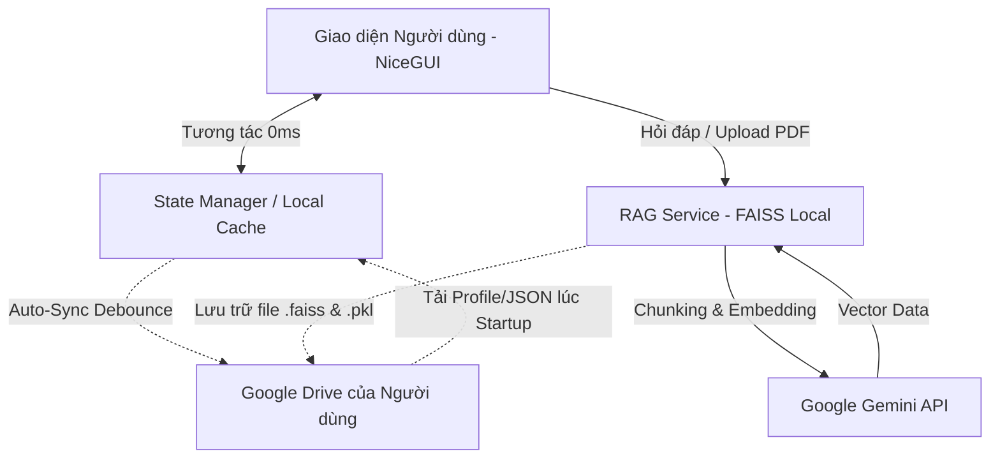

# PHẦN 1: TƯ DUY THIẾT KẾ VÀ KIẾN TRÚC CỐT LÕI (DESIGN PHILOSOPHY & CORE ARCHITECTURE)

Dự án Môi trường Học tập Cá nhân hóa (Personalized Learning Environment - PLE) không chỉ là một ứng dụng phần mềm giáo dục đơn thuần, mà là một bước chuyển dịch lớn về mặt tư duy kiến trúc so với các Hệ thống Quản lý Học tập (LMS) truyền thống. Dưới đây là phân tích chi tiết về triết lý giáo dục và các quyết định kiến trúc kỹ thuật của hệ thống.

## 1.1. Triết lý Giáo dục: Learner-Owned Education

Trong các hệ thống LMS truyền thống (như Moodle, Canvas, Coursera), dữ liệu học tập của sinh viên bị khóa chặt (locked-in) trong máy chủ của nhà trường hoặc tổ chức cung cấp. Khi sinh viên tốt nghiệp hoặc ngừng gia hạn tài khoản, toàn bộ lịch sử học tập, bản đồ kiến thức và ghi chú đều bị mất đi.

**Hệ thống PLE giải quyết triệt để bài toán này bằng triết lý "Học tập thuộc sở hữu của người học":**
- Hệ thống hoạt động như một "vỏ bọc" (interface). Toàn bộ dữ liệu sinh ra trong quá trình học (điểm số, cấu trúc cây tri thức, file PDF tài liệu, cấu trúc Vector AI) đều được lưu trữ trực tiếp vào **Google Drive cá nhân** của người học.
- Hệ quả: Người học có toàn quyền kiểm soát, chia sẻ và lưu trữ tài sản tri thức của mình vĩnh viễn, tạo nên một bộ hồ sơ năng lực số (Digital Portfolio) đích thực.

## 1.2. Kiến trúc Kỹ thuật: Backendless & Phân tán

Để phục vụ cho triết lý trên, hệ thống áp dụng kiến trúc không máy chủ trung tâm (Backendless/Stateless).

### Sơ đồ Kiến trúc Hệ thống

### Ưu điểm của Kiến trúc:
1. **Zero-Latency Interactions:** Mọi tương tác của người dùng (nhận điểm XP, hoàn thành bài học, cập nhật Node) đều chỉ thao tác đọc/ghi trên bộ nhớ tạm (Local RAM/State Manager). Trải nghiệm sử dụng là tức thời (0ms độ trễ).
2. **Auto-Sync Debounce:** Hệ thống có vòng lặp ngầm đánh giá sự thay đổi dữ liệu. Nếu có thay đổi, hệ thống sẽ tự động đồng bộ (Push) file JSON lên Google Drive sau một khoảng thời gian chờ (Debounce 5s) thay vì liên tục gọi API. Điều này vừa giúp tiết kiệm băng thông, vừa tránh lỗi giới hạn tốc độ (Rate Limit) của Google API.
3. **Self-Healing & Offline Ready:** Dữ liệu JSON độc lập giúp ứng dụng dễ dàng nạp lại trạng thái (Rehydrate) khi gặp sự cố, tạo tiền đề để nâng cấp thành Progressive Web App (PWA) hỗ trợ học tập Offline trong tương lai.

## 1.3. Hệ sinh thái AI Cục bộ (Local RAG & Omni-Tutor)

Khác với các hệ thống chatbot AI thông thường chỉ gửi prompt trơn lên máy chủ, PLE xây dựng một hệ thống RAG (Retrieval-Augmented Generation) lai ghép.

- **Ingestion & Vectorization:** Khi người dùng tải lên tài liệu học thuật (PDF), hệ thống sử dụng thuật toán băm nhỏ (Recursive Character Text Splitter) và gửi đến mô hình Embedding của Gemini. 
- **Local FAISS Database:** Thay vì thuê một cơ sở dữ liệu Vector trên Cloud đắt đỏ, hệ thống lưu trực tiếp các Index Vector dưới dạng file cục bộ (`.faiss` và `.pkl`). Đặc biệt, các file cấu trúc não bộ AI này cũng được tải ngược lên Google Drive của sinh viên.
- **Dynamic Download:** Mỗi khi người dùng hỏi bài về một môn học cụ thể, hệ thống sẽ kéo 2 file FAISS từ Drive của họ xuống RAM, cho phép tra cứu ngữ nghĩa tức thời với độ chính xác cao và có khả năng trích dẫn số trang nguồn minh bạch.

## 1.4. Động lực học tập & Khoa học nhận thức (Gamification)

Việc học tập cá nhân hóa đòi hỏi tính tự giác cao. Do đó, hệ thống tích hợp sâu các cơ chế game hóa (Gamification) vào lõi:
- **Cơ chế Thưởng phạt (XP & Streak):** Mọi hành động từ đăng nhập, hoàn thành trắc nghiệm đến việc upload tài liệu đều được định lượng hóa bằng Điểm kinh nghiệm (XP) và chuỗi ngày học liên tục (Streak).
- **Phân loại Bloom (Bloom Taxonomy):** Điểm số thuần thục (Mastery Score) của từng Khái niệm không đánh giá chung chung mà chia theo 6 cấp độ nhận thức của Bloom (Nhớ, Hiểu, Vận dụng, Phân tích, Đánh giá, Sáng tạo), giúp AI đề xuất chính xác loại bài tập cần ôn luyện.
